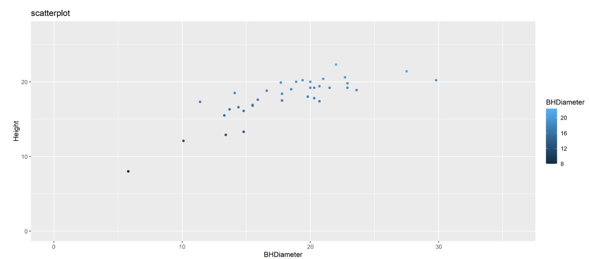
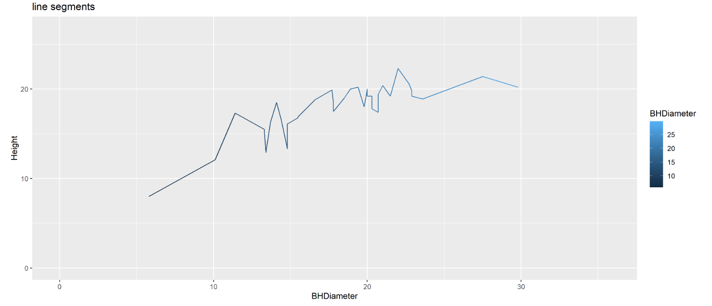
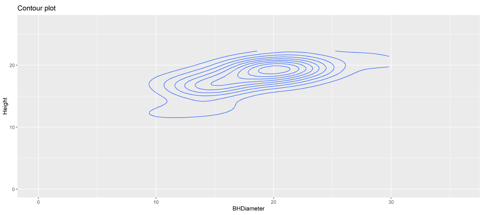
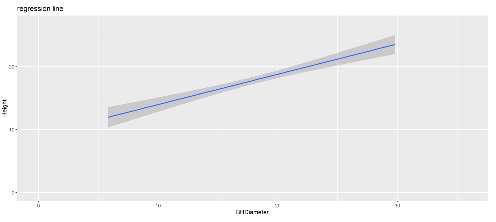

```{r setup, include=FALSE}
knitr::opts_chunk$set(echo = TRUE)
```

# Task 1

WD

```{r}
getwd()
```

# Task 2

```{r}
spruce.df = read.csv("SPRUCE.csv")
head(spruce.df)
```

# Task 3

## o	Make a scatter plot of the data (y axis will be the Height).
```{r}
plot(Height~BHDiameter, data = spruce.df, main = "Height vs BHDiameer", pch = 21, bg ="Blue", cex = 1.2, ylim=c(0, 1.1*max(Height)),xlim=c(0,1.1*max(BHDiameter)))
```

## Does there appear to be a straight line relationship?

There definetly is a positive relationship between Height and BHDiameter, although I still can't be sure it is a straight line relationship.

## o	Load the library s20x and make a lowess smoother scatter plot using trendscatter() (try a few values of f, f=0.5,0.6,0.7) record all three plots, use layout().

```{r}
library(s20x)
layout(matrix(1:4,nr=2,nc=2,byrow=TRUE))
trendscatter(Height~BHDiameter,f=0.5, data=spruce.df)
trendscatter(Height~BHDiameter,f=0.6, data=spruce.df)
trendscatter(Height~BHDiameter,f=0.7, data=spruce.df)


```

## o	We will assume (this may in fact be a bad assumption) a straight line relationship, use lm and make a linear model object, call it spruce.lm 

```{r}
spruce.lm = lm(Height~BHDiameter, data = spruce.df)
summary(spruce.lm)
```


## o	Make a new scatter plot and add the least squares regression line to the points -abline(spruce.lm) – record the plot.


```{r}
l = layout(1)

with(spruce.df, plot(Height~BHDiameter, main="Height vs BHDiameter for tree", xlab="Breast Height Diameter of tree (cm)", ylab="Height of tree (m)", pch=21, bg="Blue", cex=1.2,xlim=c(0,max(BHDiameter)*1.1),ylim=c(0,max(Height)*1.1), data=spruce.df))
abline(spruce.lm)
```

## o	Comment on the graph, is a straight line appropriate? Consider the smoother curve also.

Line Regression is not a good fit for this data, a curved trendline would fit more perfectly


# Task4:

### o	Divide the graphical interface into 4 equal areas, use layout.show(4) and record the picture.


### 	In the first square, plot the scatter plot and fitted line.
### 	In the second square plot the same with the residual line segments (deviations about the fitted line). (RSS=residual sum of squares)
### 	In the third square plot the mean of Y versus X i.e. mean of Height vs BHDiameter, with the fitted line and deviations of the fitted line from the mean height added. (MSS=model sum of squares)
### 	In the fourth square plot the mean of Height versus BHDiameter and show the total deviation line segments y ̂=y ̅. (TSS=total sum of squares) 

```{r}

l=layout(matrix(1:4, nrow=2, ncol=2, byrow=TRUE))
mycex=1
with(spruce.df, plot(Height~BHDiameter, main="Height vs BHDiameter for tree", xlab="Breast Height Diameter of tree (cm)", ylab="Height of tree (m)", pch=21, bg="Blue", cex=mycex,xlim=c(0,max(BHDiameter)*1.1),ylim=c(0,max(Height)*1.1)))
abline(spruce.lm)

yhat=fitted(spruce.lm)
with(spruce.df, plot(Height~BHDiameter, main="residual sum of squares (RSS)", xlab="Breast Height Diameter of tree (cm)", ylab="Height of tree (m)", pch=21, bg="Blue", cex=1.2,xlim=c(0,max(BHDiameter)*1.1),ylim=c(0,max(Height)*1.1)))
abline(spruce.lm)

with(spruce.df, {segments(BHDiameter, Height, BHDiameter, yhat)})
abline(spruce.df)


with(spruce.df, plot(Height~BHDiameter, main="Model Sum of Squares (MSS)", xlab="Breast Height Diameter of tree (cm)", ylab="Height of tree (m)", pch=21, bg="Blue", cex=1.2,xlim=c(0,max(BHDiameter)*1.1),ylim=c(0,max(Height)*1.1)))
with(spruce.df, abline(h=mean(Height)))
with(spruce.df, {segments(BHDiameter, mean(Height), BHDiameter, yhat, col="red")})
abline(spruce.lm)


with(spruce.df, plot(Height~BHDiameter, main="Total Sum of Squares (TSS)", xlab="Breast Height Diameter of tree (cm)", ylab="Height of tree (m)", pch=21, bg="Blue", cex=1.2,xlim=c(0,max(BHDiameter)*1.1),ylim=c(0,max(Height)*1.1)))
with(spruce.df, abline(h=mean(Height)))
with(spruce.df, {segments(BHDiameter, Height, BHDiameter, mean(Height), col="Green")})

```

## Calculate TSS, MSS and RSS

### RSS

```{r}
RSS=with(spruce.df, sum((Height-yhat)^2))
RSS
```
### MSS

```{r}
MSS=with(spruce.df, sum((yhat-mean(Height))^2))
MSS
```

### TSS

```{r}
TSS=with(spruce.df, sum((Height-mean(Height))^2))
TSS
```

## Calculate MSS/TSS and interpret it!

```{r}
MSS/TSS
```

## Does TSS=MSS+RSS?

```{r}
MSS+RSS
```

Yeah It does 


# Task5:


Summarize spruce.lm

```{r}
summary(spruce.lm)
```

## What is the value of the slope?

```{r}
coef(spruce.lm)
```
### Slope

Slope = 0.4814743


## What is the value of the intercept?

### Intercept

Intercept = 9.1468390

##	Write down the equation of the fitted line

HEIGHT= 9.1468390+(0.4814743)*(Breast Height Diameter)


## Predict the Height of spruce when the Diameter is 15, 18 and 20 cm 

```{r}
predict(spruce.lm,data.frame(BHDiameter=c(15,18,20)))
```

# Task6:

```{r}
library(ggplot2)

gg=ggplot(spruce.df, aes(x=BHDiameter, y=Height, color=BHDiameter))+geom_point()+geom_line()+geom_smooth(method="lm")+ggtitle("Height of tree vs Breast Height Diameter of tree")

gg
```


# Task7:

This is how you place images in RMD documents

{ width=70% }

{ width=70% }

{ width=70% }

{ width=70% }


